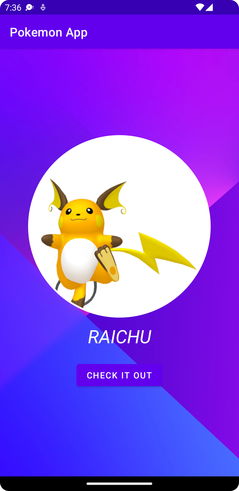
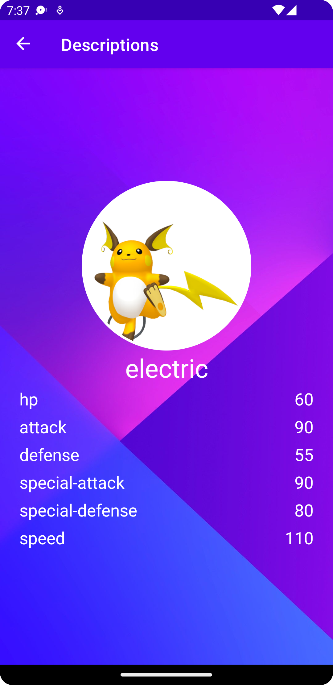

# Pokemon APP

## General

- [Before you start](#before-you-start)

- [Settings](#settings)

- [Libraries Used](#libraries-used)

- [About the project](#about-the-project)

- [Notes](#notes)

## Before you start
This project requires the following

1. Android Studio Chipmunk | 2021.2.1 Patch 1
2. Android SDK 23 or above.
3. AGP 7.2.1.

This is a app built with Kotlin.

## Settings

This project has been created with gradle version 7.0, to build please check that you have the Java 11 version setting in your project structure.

## Libraries Used
- MVVM - ViewModel
- Fragments
- Safe Args
- LiveData
- Android KTX
- Coroutines
- Retrofit
- Navigation Components
- Scope Functions
- ViewBinding
- Hilt - Dependency Injection
- MockK and JUnit for unit tests

## About the project
All the data is coming from https://pokeapi.co/ API RESTful services.
The first page shows and gets the name and picture of the pokemon. It is supposed to show detail screen and descriptions about it.
It is considering getting a random Pokemon every time you start the app.
This project follows the MVVM design pattern and SOLID principles.

|  |  |

## Notes
Open to receive improvements using Pull Requests